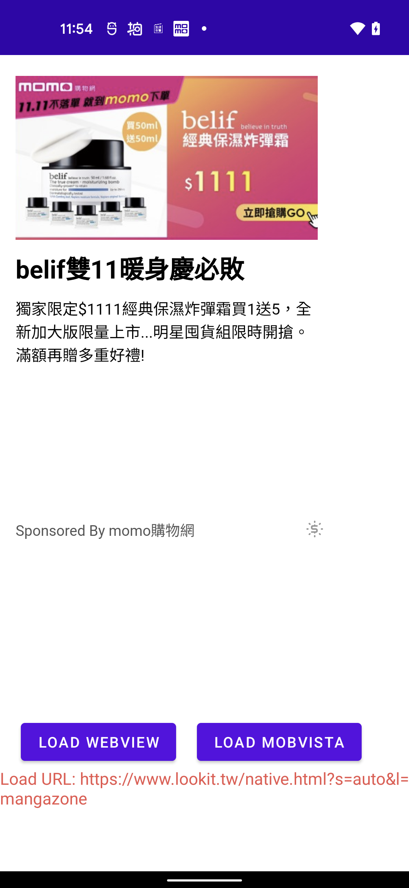

## Demo Webview backfill

有兩個按鈕分別可以 load webview 或者 mobvista 廣告，其中 webview 的邏輯是遇到 onFail 會進行 load mobvista，細節實作可以參考 demo code，另外下方有提供 log console，可以看到相關的事件。

* Config

    ```kotlin
    object Config {
        const val PACKAGE = ""
        const val WEB_URL = ""
    }
    ```
    
* ScreenShot

    

* 提供廣告類型

    |name|type|
    |---|---|
    |mobvista|banner|

* Library

    |name|package|
    |---|---|
    |mobvista|com.mbridge.msdk.oversea:mbnative:15.7.41|
    |mobvista|com.mbridge.msdk.oversea:mbnativeadvanced:15.7.41|

* Gradle Config

    ```
    repositories {
        maven { url 'https://thefirstweb.github.io/repo/' }
        maven { url "https://dl-maven-android.mintegral.com/repository/mbridge_android_sdk_oversea" }
    }
    
    
    // sitemaji
    implementation 'com.sitemaji.sdk:sitemaji:1.11.1@aar'
    
    
    // mobvista
    implementation 'com.mbridge.msdk.oversea:mbnative:15.7.41'
    implementation 'com.mbridge.msdk.oversea:mbnativeadvanced:15.7.41'
    ```
    
* SitemajiBanner

    ```
    SitemajiNative mSitemajiBanner = new SitemajiNative();
    mSitemajiBanner(this, "mobvista", ....);
    ```
    
    [https://gist.github.com/showsky/6b3f04675edf3b9b3a84aff834a5dd37](https://gist.github.com/showsky/6b3f04675edf3b9b3a84aff834a5dd37)


* Produard

    ```
    # Mobvista
    -keepattributes Signature
    -keepattributes *Annotation*
    -keep class com.mbridge.** {*; }
    -keep interface com.mbridge.** {*; }
    -keep interface androidx.** { *; }
    -keep class androidx.** { *; }
    -keep public class * extends androidx.** { *; }
    -dontwarn com.mbridge.**
    -keep class **.R$* { public static final int mbridge*; }
    ```